# Knot 流量处理全流程详解

## 总览架构图

系统存在两条**并行的捕获路径**：传输层（数据包级别）和应用层（协议/流级别），通过 `flow_id` 关联。

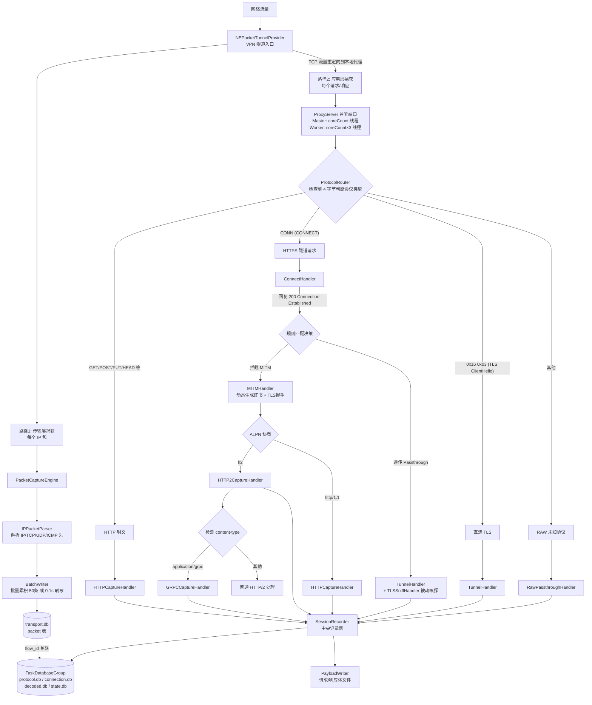

---

## 传输层：数据包捕获（路径1）

这是一条**独立于代理层的底层捕获路径**，在 VPN 隧道入口处捕获所有原始 IP 包。

### 捕获流程

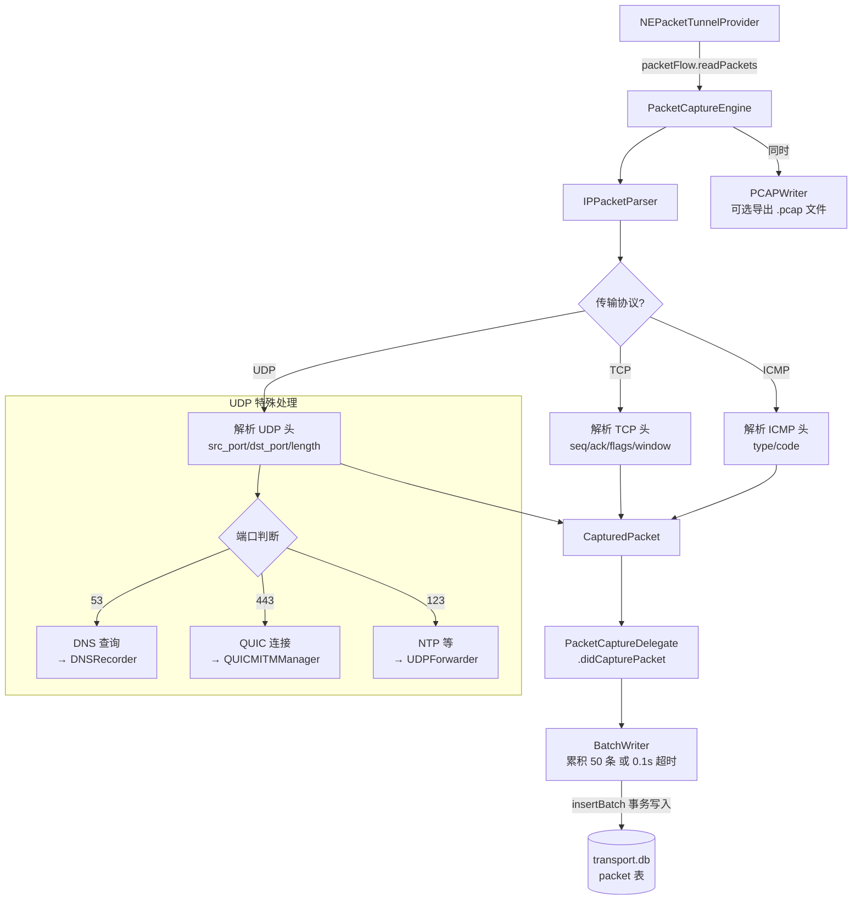

### 入口文件

| 平台 | 文件 |
|-----|------|
| macOS | `SystemExtension-macOS/MacPacketTunnelProvider.swift` |
| iOS | `PacketTunnel-iOS/PacketTunnelProvider.swift` |

### packet 表结构

| 字段 | 类型 | 说明 |
|-----|------|------|
| id | INTEGER PK | 自增主键 |
| flow_id | TEXT | 关联应用层 flow 记录 |
| direction | INTEGER | 入站/出站 |
| timestamp | REAL | 捕获时间 |
| ip_version | INTEGER | 4 或 6 |
| src_ip / dst_ip | TEXT | 源/目标 IP |
| transport | INTEGER | 6=TCP, 17=UDP, 1=ICMP |
| src_port / dst_port | INTEGER | 源/目标端口 |
| seq_no / ack_no | INTEGER | TCP 序列号/确认号 |
| tcp_flags | INTEGER | TCP 标志位 (SYN/ACK/FIN 等) |
| window_size | INTEGER | TCP 窗口大小 |
| payload_length | INTEGER | 负载长度 |
| payload_ref | TEXT | 负载文件引用 |

### 写入机制

- **BatchWriter**: 累积到 **50 条**或超时 **0.1 秒**自动 flush，在事务中批量 INSERT
- 使用独立的 serial DispatchQueue 保证线程安全，避免 SQLite BUSY

### 两条路径的关系

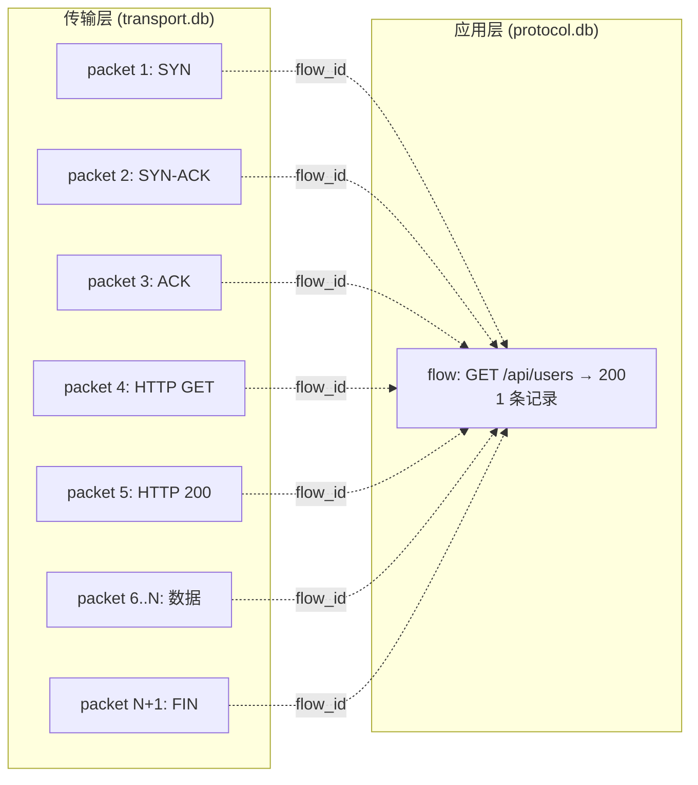

| 对比维度 | 传输层 (packet) | 应用层 (flow) |
|---------|----------------|--------------|
| 数据库 | transport.db | protocol.db |
| 粒度 | 每个 IP 包一条记录 | 每个请求/响应一条记录 |
| 捕获位置 | VPN 隧道入口 (NEPacketTunnelProvider) | 本地代理 (ProxyServer) |
| 内容 | IP/TCP/UDP 头、包长、时序 | method、URI、headers、status、decoded payload |
| 协议覆盖 | 所有 IP 流量 (TCP/UDP/ICMP) | HTTP、HTTPS、WebSocket、gRPC、DNS |
| 关联方式 | flow_id 字段 | flow_id 字段 |

> **当前状态**: Schema、DAO、BatchWriter、Parser 均已实现，但 `PacketCaptureEngine` → `PacketDAO` 的调用尚未接通，属于 Phase 3 计划任务。

---

## 应用层：协议捕获（路径2）

以下为应用层代理管线的详细处理过程。

---

## 第1层：ProtocolRouter — 协议路由

**文件**: `Proxy/ProtocolRouter.swift`

| 检测特征 | 判定协议 | 走向 |
|---------|---------|------|
| `GET ` / `POST` / `PUT` / `HEAD` 等 | HTTP 明文 | → `configureHTTPPipeline()` |
| `CONN` (HTTP CONNECT) | HTTPS 隧道请求 | → `configureHTTPSPipeline()` |
| `0x16 0x03 xx xx` (TLS ClientHello) | 直连 TLS | → `configureTunnelPipeline()` |
| 其他 | 未知/RAW | → `configureRawPipeline()` |

**职责**: 读取连接的前几个字节，决定后续 pipeline 该装哪些 Handler。

---

## 第2层：协议处理器（四条主线）

### 主线1: HTTP 明文

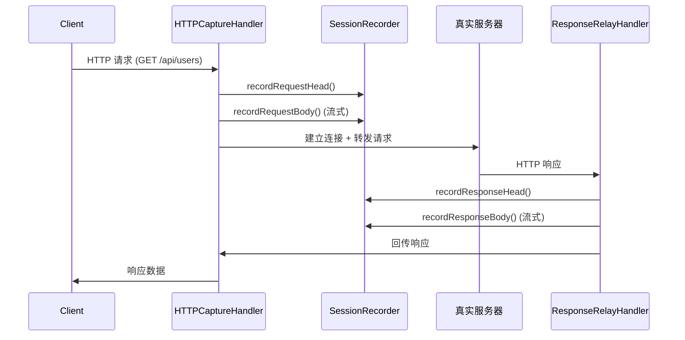

**HTTPCaptureHandler** 干的活：
- 接收客户端 HTTP 请求
- 调用 `SessionRecorder.recordRequestHead()` 记录请求头
- 调用 `SessionRecorder.recordRequestBody()` 流式写入请求体
- 通过 `ClientBootstrap` 连接真实服务器，转发请求
- 通过 `ResponseRelayHandler` 接收服务器响应
- 调用 `recordResponseHead()` / `recordResponseBody()` / `recordResponseEnd()`
- 将响应回传给客户端

### 主线2: HTTPS 隧道

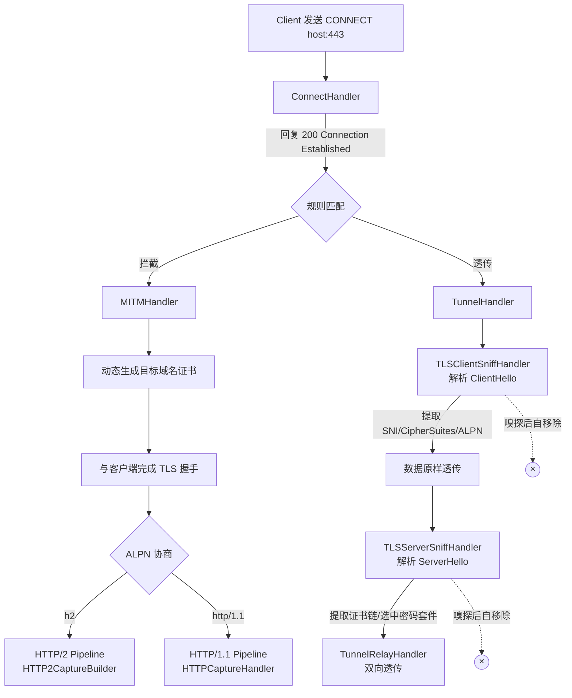

**ConnectHandler**: 处理 CONNECT 请求，根据规则引擎决定是 MITM 拦截还是透传

**MITMHandler**:
- 用 CA 证书动态签发目标域名的证书
- 与客户端完成 TLS 握手（客户端以为在跟真实服务器通信）
- ALPN 协商后分流到 HTTP/1.1 或 HTTP/2 管线

**TLSSniffHandler** (透传模式下的被动嗅探):
- `TLSClientSniffHandler`: 解析 ClientHello → 提取 SNI、密码套件列表、ALPN
- `TLSServerSniffHandler`: 解析 ServerHello → 提取选中的密码套件、证书链
- **不修改任何数据**，只读取元数据后自行移除

### 主线3: 直连 TLS

直接走 `TunnelHandler`，类似 HTTPS 透传模式。

### 主线4: RAW 未知协议

`RawPassthroughHandler`: 记录前几个字节作为样本，创建最小化的 FlowRecord，数据原样透传。

---

## 第3层：SessionRecorder — 中央记录器

**文件**: `Storage/Proxy/SessionRecorder.swift`

**每个连接创建一个 SessionRecorder**，它是所有数据记录的中枢：

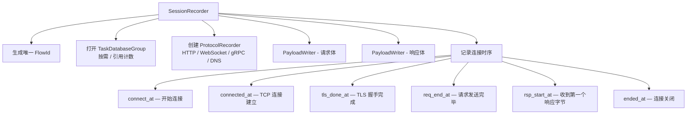

---

## 第4层：协议特化记录器

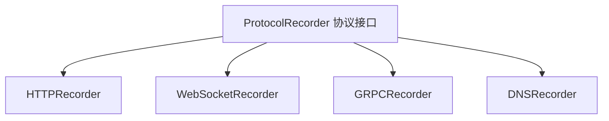

| 记录器 | 记录内容 | 搜索键 |
|-------|---------|-------|
| **HTTPRecorder** | method, uri, status, headers, timing | key1=method, key2=uri, key3=statusCode, key4=contentType |
| **WebSocketRecorder** | 帧数量、帧方向、帧类型、close code | key1=subprotocol, key2=uri, key3=totalFrames, key4=closeCode |
| **GRPCRecorder** | service, method, grpc status, 请求/响应 messages | key1=method, key2=service, key3=grpcStatus, key4=grpcMessage |
| **DNSRecorder** | query domain, type, response code, answers | key1=queryType, key2=domain, key3=firstAnswer, key4=responseCode |

**GRPCRecorder 特殊行为**: 初始化时就做一次 **preliminary insert**（安全插入），确保即使连接中途断开也有记录。

---

## 第5层：WebSocket 升级流程

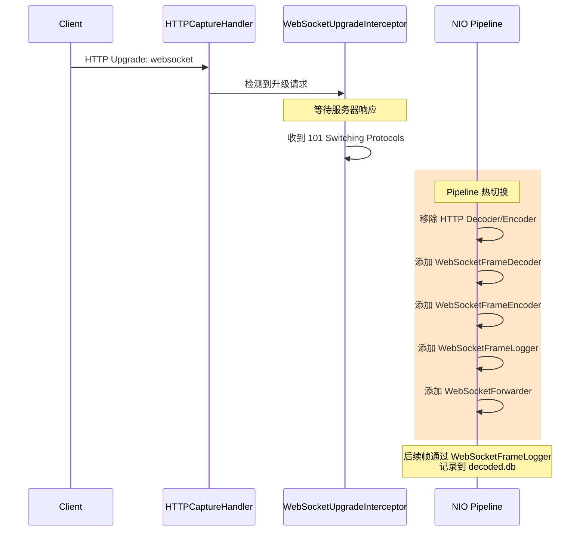

**WebSocketFrameLogger** 记录到 decoded.db:
- 帧类型 (text/binary/ping/pong/close)
- 方向 (client→server / server→client)
- 时间戳
- 负载预览

---

## 数据库写入全景图

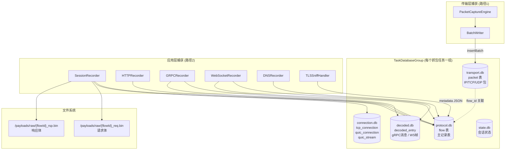

### 谁在什么时候写了什么

| 时机 | 写入目标 | 写入内容 | 捕获路径 |
|-----|---------|---------|---------|
| 每个 IP 包到达 | `BatchWriter` → transport.db | IP/TCP/UDP 头、seq/ack/flags、包长 | 路径1: 传输层 |
| 累积 50 条或 0.1s | `PacketDAO.insertBatch()` → transport.db | 批量事务写入 packet 表 | 路径1: 传输层 |
| 收到请求体 | `PayloadWriter` → 文件系统 | 请求 body 二进制流 | 路径2: 应用层 |
| 收到响应体 | `PayloadWriter` → 文件系统 | 响应 body 二进制流 | 路径2: 应用层 |
| gRPC 初始化 | `FlowDAO` → protocol.db | preliminary FlowRecord（防丢失） | 路径2: 应用层 |
| gRPC 每条消息 | `DecodedEntryDAO` → decoded.db | 单条 gRPC message | 路径2: 应用层 |
| WebSocket 每帧 | `DecodedEntryDAO` → decoded.db | 帧元数据 | 路径2: 应用层 |
| 连接关闭时 | `FlowDAO` → protocol.db | 完整 FlowRecord（最终版） | 路径2: 应用层 |
| 连接关闭时 | `TcpConnectionDAO` → connection.db | TCP 连接元数据 | 路径2: 应用层 |
| TLS 嗅探时 | FlowRecord metadata (JSON) | TLS SNI/密码套件/证书链 | 路径2: 应用层 |

**线程安全**: 每个数据库有独立的 serial DispatchQueue，所有写入都通过队列串行化。

---

## 一个完整 HTTP 请求的生命周期

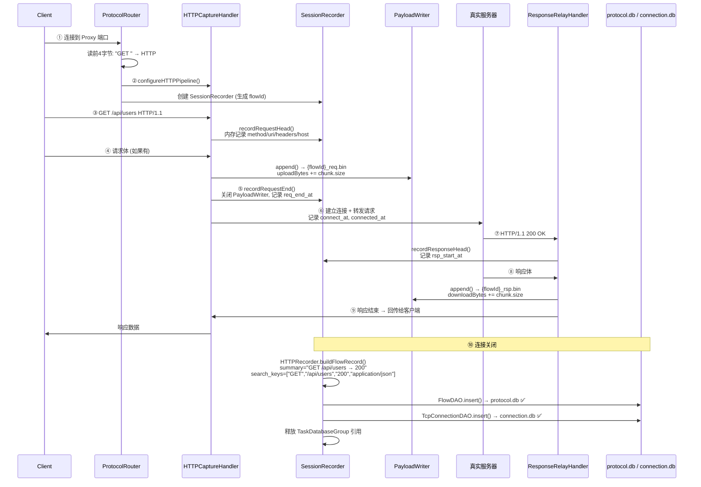

---

## Handler 依赖关系图

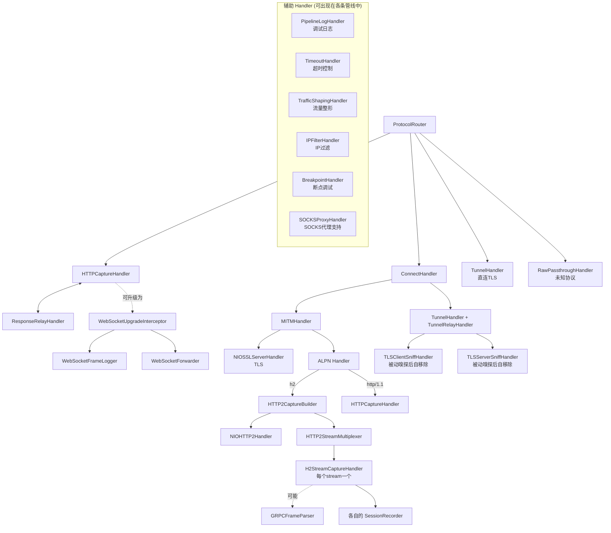

---

## DAO 层 (数据访问对象)

| DAO | 数据库 | 职责 |
|-----|-------|------|
| **FlowDAO** | protocol.db | 插入/更新/查询流量记录 |
| **TcpConnectionDAO** | connection.db | TCP 连接生命周期跟踪 |
| **PacketDAO** | transport.db | 数据包存储 |
| **DecodedEntryDAO** | decoded.db | gRPC 消息 / WebSocket 帧存储 |
| **QuicConnectionDAO** | connection.db | QUIC 连接跟踪 |
| **QuicStreamDAO** | connection.db | QUIC 流跟踪 |
| **CatalogDAO** | catalog.db | 任务和规则管理 |
| **TaskStatsDAO** | — | 统计聚合 |

所有 DAO 使用 prepared statements + 参数绑定，防止 SQL 注入。

---

## 关键设计原则

1. **流式处理**: Payload 从不整体加载到内存，用 PayloadWriter 32KB 缓冲流式写入文件
2. **Fail-safe 写入**: gRPC 等长连接协议初始化就插入 preliminary record，防止中途断开丢数据
3. **引用计数**: TaskDatabaseGroup 通过引用计数管理生命周期，最后一个 SessionRecorder 关闭时才关库
4. **Pipeline 热切换**: WebSocket 升级时动态移除 HTTP Handler、装入 WS Handler，无需断开重连
5. **线程安全**: NIO Handler 运行在 EventLoop，数据库写入通过 serial DispatchQueue 串行化
6. **协议抽象**: `ProtocolRecorder` 统一接口生成 `FlowRecord`，`SearchKeyMapping` 提供协议特定搜索字段
